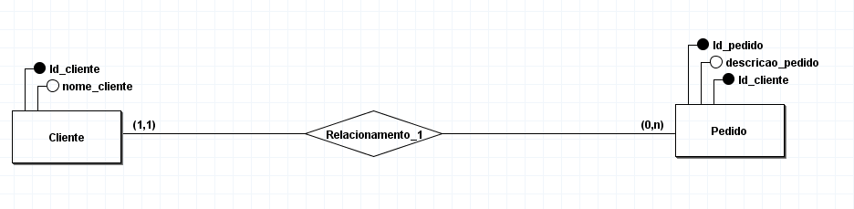

Você foi contratado para projetar um banco de dados para uma empresa que gerencia clientes e pedidos. Sua tarefa é desenvolver os modelos: conceitual, lógico e físico para este sistema.

Vamos criar duas entidades: Cliente e Pedido, e um relacionamento entre elas.
Campos: 
Cliente
id_cliente (chave primária), 
nome_cliente.
Pedido
Campos: 
id_pedido (chave primária), 
descricao_pedido.
Um cliente pode fazer vários pedidos
Um pedido está relacionado somente a um cliente.

Modelagem Conceitual
Desenhe um diagrama entidade-relacionamento (DER) representando as entidades Cliente e Pedido e o relacionamento entre elas.
Modelagem Lógica
Converta o diagrama entidade-relacionamento (DER) em um modelo relacional. Liste as tabelas necessárias, seus atributos e as chaves primárias e estrangeiras.
Modelagem Física
Utilizando SQL, crie as tabelas correspondentes ao modelo relacional definido na etapa de modelagem lógica.
Insira alguns dados de exemplo nas tabelas para testar o banco de dados.
Observações
Certifique-se de definir corretamente as chaves primárias e estrangeiras para manter a integridade dos dados.
Verifique se os tipos de dados escolhidos para cada atributo são apropriados para os dados que serão armazenados.
Ao criar o modelo físico, preste atenção aos detalhes de sintaxe SQL específicos do sistema de gerenciamento de banco de dados (SGBD) que você está utilizando.
DOCUMENTAÇÃO
https://dev.mysql.com/doc/refman/8.3/en/numeric-types.html

