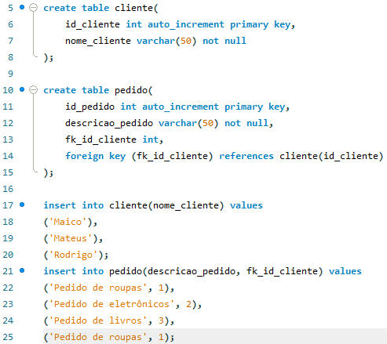

Descrição
Nesta atividade, você realizará um teste do banco de dados que foi criado anteriormente. O teste envolverá a inserção de dados de exemplo nas tabelas Clientes e Pedidos, permitindo verificar se o banco de dados está funcionando conforme o esperado.

- Objetivo
- Inserir dados de exemplo para testar o banco de dados.
- Instruções
- Inserção de Dados:

Insira os seguintes dados de exemplo nas tabelas Clientes e Pedidos do banco de dados:
- Três Clientes.
- Quatro Pedidos.

Instruções:
Inserção de Dados:

Ao utilizar o comando INSERT INTO e especificar as colunas, você pode inserir valores apenas para as colunas desejadas.
           
           INSERT INTO nomeDaTabela (coluna1, coluna2, coluna3) VALUES (valor1, valor2, valor3);
           Neste exemplo, estamos inserindo valores apenas para as colunas coluna1, coluna2 e coluna3
           
          