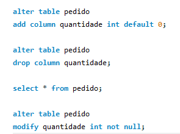

Modificação de Coluna para Adicionar Restrição NOT NULL
Nesta atividade prática, exploraremos como fazer alterações em um banco de dados MySQL. Nosso objetivo é modificar uma coluna existente na tabela pedido para adicionar uma restrição NOT NULL. Esta coluna foi originalmente criada sem a restrição e agora vamos garantir que não aceite valores nulos.

Instruções

ALTER TABLE pedido
MODIFY quantidade int NOT NULL;

