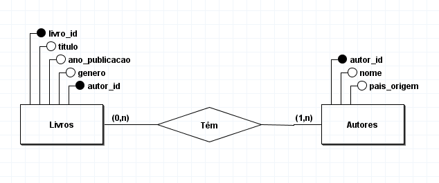
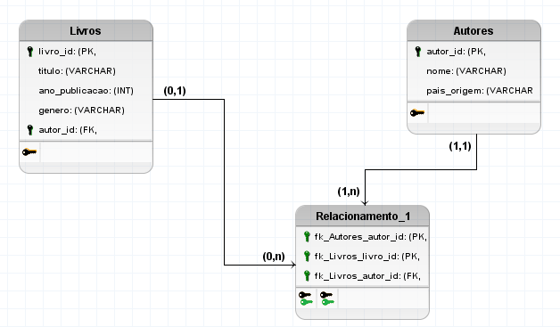
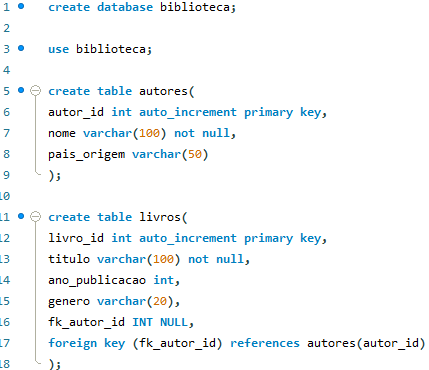

Descrição
Você foi contratado para criar o projeto conceitual e lógico de um banco de dados para uma biblioteca online. A biblioteca precisa armazenar informações sobre os livros disponíveis e seus respectivos autores.

Requisitos do Sistema:

Tabelas

- Livros
- Autores

Cardinalidade

- Livros
           Cada livro deve ter um título, ano de publicação e gênero.
- Autores
           Cada autor deve ter um nome e país de origem.
- Relacionamento
           Um livro pode ter apenas um autor, mas um autor pode ter escrito vários livros.
           Nem todos os livros precisam estar associados a um autor, permitindo a existência de livros sem autores registrados.
           Nem todos os autores precisam estar associados a livros, permitindo a existência de autores sem livros registrados.

Atributos Livros:
- livro_id (PK, INT)
- titulo (VARCHAR)
- ano_publicacao (INT)
- genero (VARCHAR)
- autor_id (FK, INT, NULL)

Atributos Autores:
- autor_id (PK, INT)
- nome (VARCHAR)
- pais_origem (VARCHAR)

Especificar as Chaves Primárias e Estrangeiras:

 Entregáveis
Modelo Conceitual:

            Diagrama ER mostrando as entidades, atributos e relacionamentos, incluindo a cardinalidade.
Modelo Lógico:

           Descrição das tabelas e seus campos.
           Especificação das chaves primárias e estrangeiras.
           Definição dos tipos de dados e restrições para cada campo.
Modelo Projeto Físico:

            Inserir colunas, tipos de dados, restrições para cada campo.

