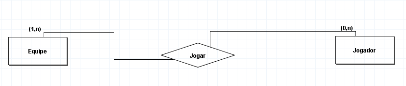

4. Uma equipe é composta por vários jogadores, e  pode existir equipe sem jogador. Um jogador joga apenas em uma equipe, pode ter jogador sem equipe. 

Após a conclusão, desenvolva o Diagrama Entidade Relacionamento

