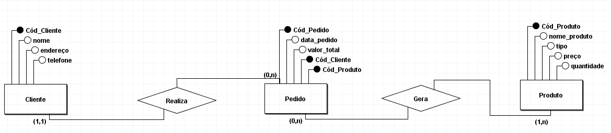

Uma floricultura deseja informatizar suas operações. Inicialmente, deseja manter um cadastro de todos os seus clientes, mantendo informações como: RG, nome, telefone e endereço. Deseja também manter um cadastro contendo informações sobre os produtos que vende, tais como: nome do produto, tipo (flor,vaso, planta,...), preço e quantidade em estoque. Além disso, a floricultura pretende registrar os pedidos realizados pelos clientes, incluindo a data do pedido e o valor total. Cada pedido estará associado a um cliente específico
Um cliente pode ter zero ou mais pedidos.
Um pedido deve estar associado a um cliente.
Um pedido pode conter um ou mais produtos.
Um produto pode estar presente em zero ou mais pedidos.

1. Liste as entidades que você identificou. 
2. Liste os relacionamentos entre as entidades.
3. Atribua o grau de relacionamento(Cardinalidade)
4. Liste os atributos de cada entidade
5. Defina as chaves primárias e estrangeiras
5. Crie o Diagrama Entidade Relacionamento

