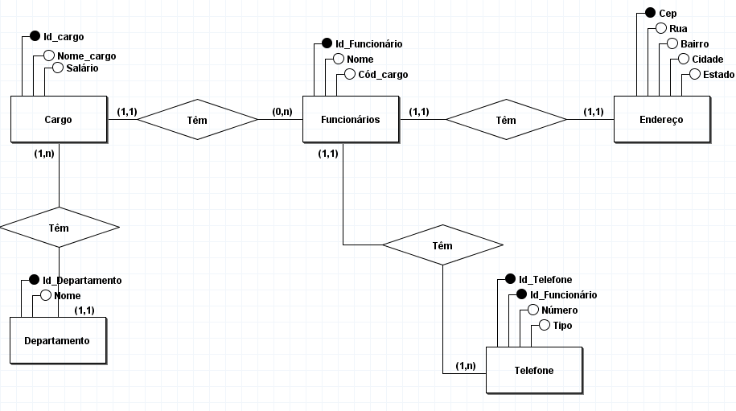

Uma pequena empresa de varejo está desenvolvendo um sistema de gerenciamento de funcionários. Neste sistema, há uma tabela de funcionários que armazena informações essenciais sobre sua equipe. A empresa tem vendedores, caixas, gerentes de departamento, entre outros. Cada funcionário é identificado por um ID único e tem um nome. Além disso, cada um ocupa um cargo específico, como vendedor ou caixa, e está vinculado a um departamento específico da loja, como departamento de vestuário ou eletrônicos. Cada funcionário recebe um salário mensal fixo.

Além das informações básicas, cada funcionário possui um número de telefone para contato e um endereço de residência registrado na empresa.

Situação Inicial (Antes da Normalização):
Tabela de Funcionários:
ID_Funcionario (PK)
- Nome
- Cargo
- Departamento
- Salário
- Telefone
- Endereço

A empresa de varejo decidiu informatizar o gerenciamento de funcionários, mas descobriu que o banco de dados existente
está inconsistente e não normalizado. Isso resulta em várias anomalias e dificuldades de manutenção, como redundância de dados, dependências transitivas e dificuldade em atualizar informações. Você foi solicitado para efetuar melhorias no sistema existente, qual seria a sugestão de melhoria.

