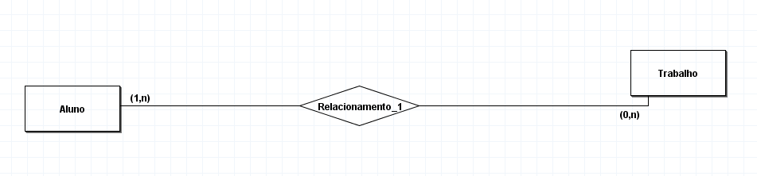

# Desenvolva o Modelo entidade-Relacionamento para as seguintes situações: 
1. Um aluno realiza vários trabalhos. Um trabalho é realizado por um ou mais alunos.

Após a conclusão, desenvolva o Diagrama Entidade Relacionamento

