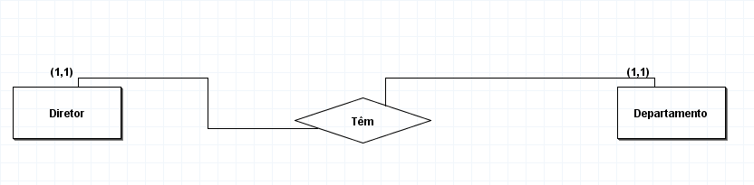

2. Um diretor no mínimo um departamento e no máximo um departamento. Um departamento tem no mínimo um diretor e no máximo um diretor. 

Após a conclusão, desenvolva o Diagrama Entidade Relacionamento

