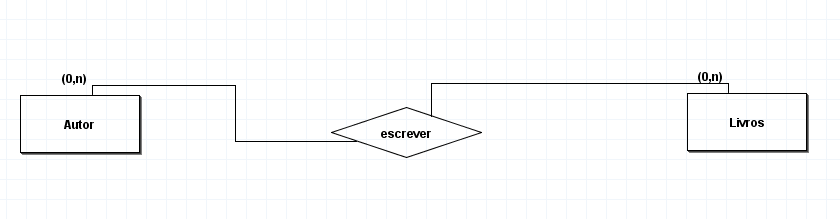

3. Um autor escreve vários livros, mas ele pode não ter nenhum livro escrito. Um livro pode ser escrito por vários autores, mas pode ter livro sem autor. 

Após a conclusão, desenvolva o Diagrama Entidade Relacionamento

