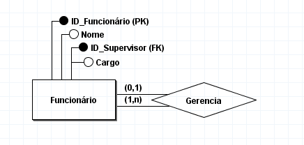

Situação: Você está trabalhando em um projeto para uma empresa que deseja rastrear a hierarquia de funcionários. Cada funcionário pode ter um supervisor que também é um funcionário na mesma empresa. Como você estruturaria o banco de dados para representar essa relação entre os funcionários?
Funcionário gerencia um ou mais funcionários
Funcionário é gerenciado por um ou nenhum funcionáro

Entidades: Funcionário

Auto-Relacionamento: Funcionário pode ser supervisor de outros Funcionários

Funcionário: ID_Funcionário (PK), Nome, Cargo, Supervisor_ID (FK referenciando ID_Funcionário na mesma tabela)

